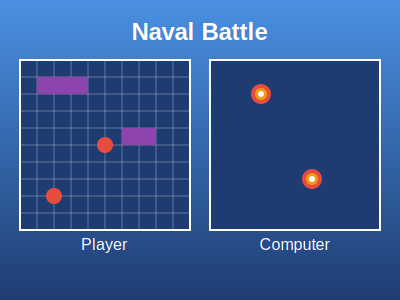

# Naval Battle: A Python-based Battleship Game



## Description

Naval Battle is a Python implementation of the classic Battleship game. This project showcases modular programming, file I/O, and game logic implementation in Python. Players can engage in a strategic battle against a computer opponent, trying to sink each other's fleet before their own is destroyed.

## Features

- Player vs Computer gameplay
- Modular code structure for easy maintenance and extensibility
- Multiple game board layouts to choose from
- Random computer move generation
- Interactive command-line interface
- File-based game board loading system

## How to Play

1. Run the main script:
   ```
   python navalBattle.py
   ```

2. Choose from the main menu:
   - `p` to play the game
   - `i` to view instructions
   - `q` to quit

3. If playing:
   - Select a game board for yourself
   - The computer will randomly select its board
   - Take turns targeting coordinates on your opponent's board
   - First to sink all of the opponent's ships wins!

## Project Structure

- `navalBattle.py`: Main game script
- `gameBoard.py`: Handles board-related operations
- `gameInput.py`: Manages user and computer input
- `gamePlay.py`: Controls the game flow and turn logic
- `board*.txt`: Text files containing different board layouts
- `targetBoard.txt`: Initial empty board for tracking shots

## Gameplay Example

```
Welcome to Naval Battle!

By: Abhay Prasanna Rao

[p]lay, [i]nstructions, or [q]uit?: p
Which gameboard to use for the player (1 - 5)?: 1
Human Turn

##########
##########
##########
##########
##########
##########
##########
##########
##########
##########

..........
.@........
.@....@...
.@....@...
.@..@.@...
.@..@.....
....@.....
..........
.....@@@@.
@@........
Enter the row to attack: 3
Enter the column to attack: 3
The human targets coordinates (3,3)
MISS

Computer's Turn: 
The Computer targets coordinates 7,2
MISS !
...
```

## Technologies Used

- Python 3
- Standard Python libraries: random, sys

## Future Improvements

- Graphical user interface (GUI)
- Network multiplayer support
- AI difficulty levels
- Custom ship placement for players
- Game statistics tracking

## Author

Abhay Prasanna Rao
